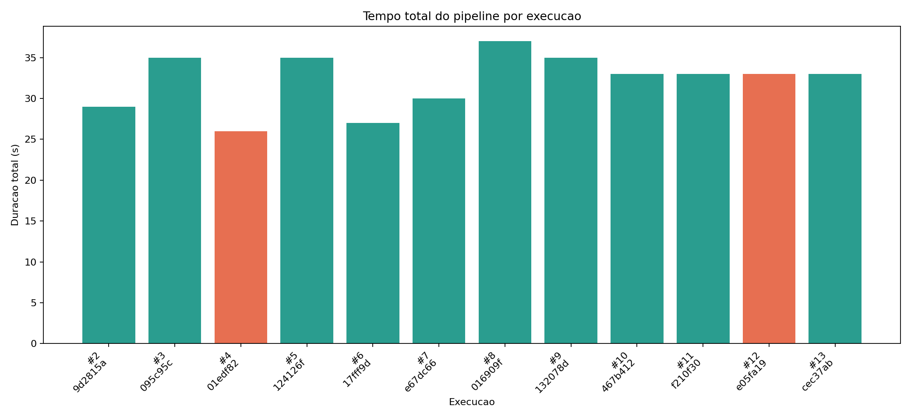
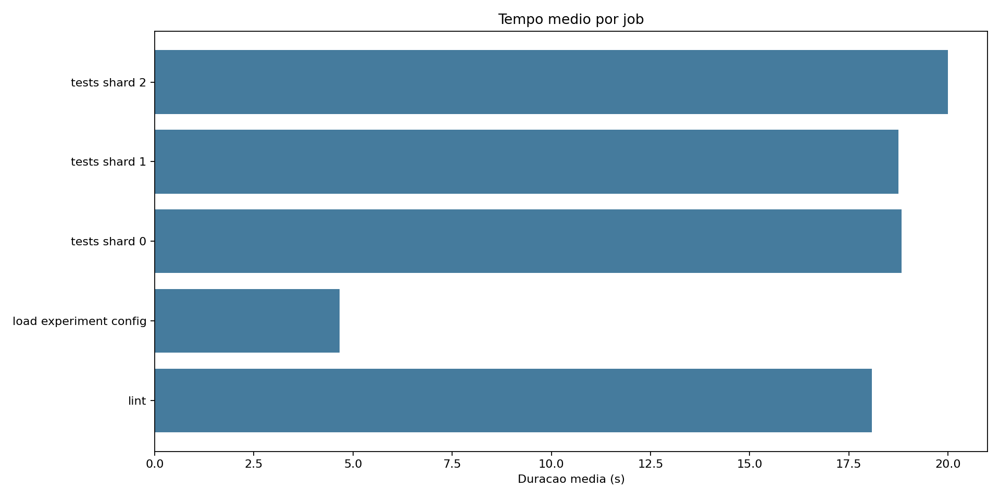
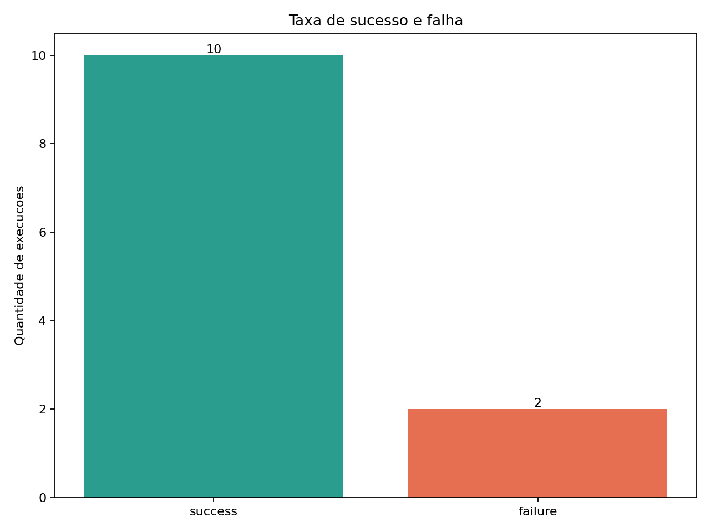
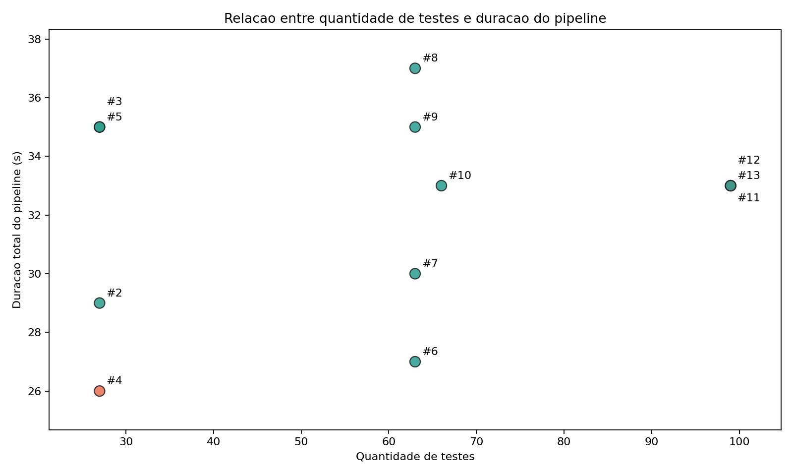
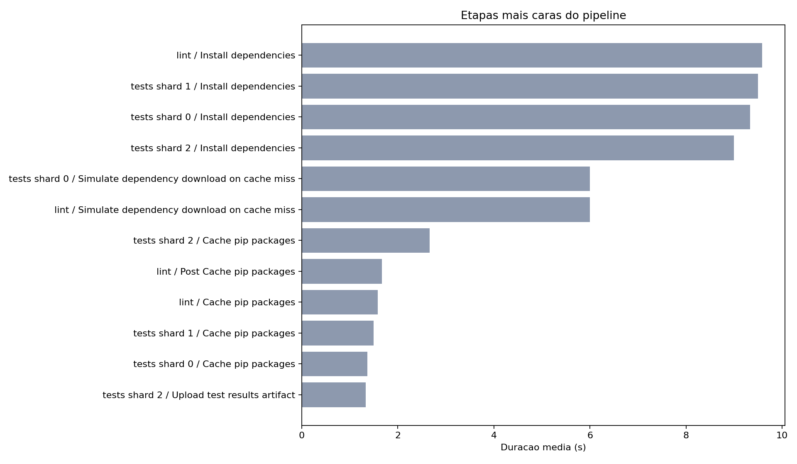

# Relatorio tecnico: metricas de pipeline CI/CD

## Links

- Repositorio: <https://github.com/FeZillo/ponderada-coletando-metricas>
- Workflow YAML: <https://github.com/FeZillo/ponderada-coletando-metricas/blob/main/.github/workflows/ci-metrics.yml>
- Historico de execucoes: <https://github.com/FeZillo/ponderada-coletando-metricas/actions/workflows/ci-metrics.yml>
- Script de coleta: [`scripts/collect_github_metrics.py`](../scripts/collect_github_metrics.py)
- Base CSV principal: [`data/run_summary.csv`](../data/run_summary.csv)

## Hipotese inicial

A hipotese inicial era que a etapa de testes seria o principal gargalo quando houvesse aumento de volume ou testes lentos, enquanto a instalacao de dependencias teria peso maior somente nas execucoes sem cache. Tambem era esperado que dividir testes em shards paralelos reduzisse a duracao total apenas quando o custo dos testes fosse maior que o overhead de criar jobs adicionais.

## Desenho do experimento

O experimento usa um projeto Python pequeno com lint via Ruff e testes via Pytest. As variacoes foram controladas pelo arquivo `experiment_config.json`, alterando quantidade de casos, lentidao artificial, falha controlada, numero de shards e versao de cache.

Foram coletadas 12 execucoes reais do GitHub Actions. A taxa de sucesso foi 83.3% (10/12) e a taxa de falha foi 16.7% (2/12). No total, os workflows reportaram 723 testes e 2 falhas de teste.

## Execucoes reais

| Run ID | Run # | Commit | Status | Duracao | Testes | Falhas | Variacao |
| --- | --- | --- | --- | --- | --- | --- | --- |
| [26888639968](https://github.com/FeZillo/ponderada-coletando-metricas/actions/runs/26888639968) | 2 | 9d2815a | success | 29.0s | 27 | 0 | baseline-rapido |
| [26888661356](https://github.com/FeZillo/ponderada-coletando-metricas/actions/runs/26888661356) | 3 | 095c95c | success | 35.0s | 27 | 0 | cache-aquecido |
| [26888682978](https://github.com/FeZillo/ponderada-coletando-metricas/actions/runs/26888682978) | 4 | 01edf82 | failure | 26.0s | 27 | 1 | falha-controlada |
| [26888706554](https://github.com/FeZillo/ponderada-coletando-metricas/actions/runs/26888706554) | 5 | 124126f | success | 35.0s | 27 | 0 | recuperacao-verde |
| [26888730952](https://github.com/FeZillo/ponderada-coletando-metricas/actions/runs/26888730952) | 6 | 17fff9d | success | 27.0s | 63 | 0 | mais-testes-60 |
| [26888751941](https://github.com/FeZillo/ponderada-coletando-metricas/actions/runs/26888751941) | 7 | e67dc66 | success | 30.0s | 63 | 0 | teste-lento |
| [26888772585](https://github.com/FeZillo/ponderada-coletando-metricas/actions/runs/26888772585) | 8 | 016909f | success | 37.0s | 63 | 0 | cache-invalidado |
| [26888794419](https://github.com/FeZillo/ponderada-coletando-metricas/actions/runs/26888794419) | 9 | 132078d | success | 35.0s | 63 | 0 | cache-v2-aquecido |
| [26888818311](https://github.com/FeZillo/ponderada-coletando-metricas/actions/runs/26888818311) | 10 | 467b412 | success | 33.0s | 66 | 0 | paralelo-2-shards |
| [26888838659](https://github.com/FeZillo/ponderada-coletando-metricas/actions/runs/26888838659) | 11 | f210f30 | success | 33.0s | 99 | 0 | paralelo-3-shards |
| [26888857775](https://github.com/FeZillo/ponderada-coletando-metricas/actions/runs/26888857775) | 12 | e05fa19 | failure | 33.0s | 99 | 1 | falha-em-paralelo |
| [26888879120](https://github.com/FeZillo/ponderada-coletando-metricas/actions/runs/26888879120) | 13 | cec37ab | success | 33.0s | 99 | 0 | final-verde |

## Commits usados

| Commit | Mensagem | Variacao |
| --- | --- | --- |
| 9d2815a | experiment: run 01 baseline-rapido | baseline-rapido |
| 095c95c | experiment: run 02 cache-aquecido | cache-aquecido |
| 01edf82 | experiment: run 03 falha-controlada | falha-controlada |
| 124126f | experiment: run 04 recuperacao-verde | recuperacao-verde |
| 17fff9d | experiment: run 05 mais-testes-60 | mais-testes-60 |
| e67dc66 | experiment: run 06 teste-lento | teste-lento |
| 016909f | experiment: run 07 cache-invalidado | cache-invalidado |
| 132078d | experiment: run 08 cache-v2-aquecido | cache-v2-aquecido |
| 467b412 | experiment: run 09 paralelo-2-shards | paralelo-2-shards |
| f210f30 | experiment: run 10 paralelo-3-shards | paralelo-3-shards |
| e05fa19 | experiment: run 11 falha-em-paralelo | falha-em-paralelo |
| cec37ab | experiment: run 12 final-verde | final-verde |

## Graficos

## Resultados quantitativos

- Duracao media do workflow: 32.2s.
- Execucao mais rapida: run #4 (26.0s, falha-controlada).
- Execucao mais lenta: run #8 (37.0s, cache-invalidado).
- Job com maior duracao media: tests shard 2 (20.0s).

### Jobs com maior duracao media

| Job | Duracao media |
| --- | --- |
| tests shard 2 | 20.0s |
| tests shard 0 | 18.8s |
| tests shard 1 | 18.8s |
| lint | 18.1s |
| load experiment config | 4.7s |

### Etapas mais caras

| Etapa | Duracao media |
| --- | --- |
| lint / Install dependencies | 9.6s |
| tests shard 1 / Install dependencies | 9.5s |
| tests shard 0 / Install dependencies | 9.3s |
| tests shard 2 / Install dependencies | 9.0s |
| tests shard 0 / Simulate dependency download on cache miss | 6.0s |

## Analise critica

### Qual etapa mais contribuiu para o tempo total do pipeline?

O maior peso medio ficou em `tests shard 2`. Observando as etapas, os maiores custos apareceram em `lint / Install dependencies` e nas etapas de instalacao/testes. Isso indica que o gargalo muda conforme a configuracao: quando ha poucos testes, setup e instalacao dominam; quando ha volume ou atraso artificial, Pytest passa a explicar a maior parte da variacao.

### Houve diferenca significativa entre execucoes com e sem cache?

Houve diferenca clara nas etapas de setup, mas o impacto no tempo total foi moderado. A execucao `cache-invalidado` registrou a etapa `Simulate dependency download on cache miss`, enquanto `cache-v2-aquecido` pulou essa etapa. Mesmo assim, o tempo total mudou pouco porque os jobs rodam em paralelo e tambem existe variabilidade natural dos runners.

### O paralelismo reduziu o tempo total? Em que condicoes?

Nos dados observados, o paralelismo nao reduziu o tempo total de forma convincente. As execucoes com 2 e 3 shards ficaram proximas de 33s, pois cada shard repetiu checkout, setup, cache e instalacao de dependencias. A conclusao e que o paralelismo so compensaria melhor se a etapa de testes fosse substancialmente mais longa que o overhead de criar jobs adicionais.

### Quais falhas foram mais frequentes?

As falhas foram controladas por `force_failure=true`, portanto o tipo mais frequente foi falha de teste automatizado no Pytest. Nao houve indicio de falha estrutural do workflow, como erro de checkout, setup de Python ou upload de artefatos.

### O pipeline fornece feedback rapido o suficiente?

Para o projeto pequeno, sim: a duracao media ficou em 32.2s. Ainda assim, o tempo cresce com cache miss, instalacao repetida e testes lentos. Em um projeto real, o feedback seria considerado bom se permanecesse abaixo de poucos minutos para commits comuns e isolasse suites longas em jobs paralelos ou noturnos.

### Melhorias possiveis

- Separar dependencias de analise, teste e visualizacao para reduzir instalacao no CI.
- Publicar um resumo Markdown no `GITHUB_STEP_SUMMARY` com metricas por execucao.
- Usar cache mais granular e evitar invalidacoes desnecessarias.
- Executar testes rapidos primeiro e suites lentas em paralelo.
- Salvar artefatos por job com nomes padronizados para facilitar auditoria.

### Resultados inesperados

1. O paralelismo nao reduziu a duracao total neste recorte. O overhead de jobs adicionais competiu com o ganho de dividir testes, especialmente porque cada shard reinstalou dependencias.
2. O cache nao eliminou todo o custo de setup. Mesmo com cache hit, ainda existe tempo de restauracao, verificacao e execucao do `pip install`, entao a diferenca apareceu mais nas etapas individuais do que no tempo total do workflow.

### Comparacao entre hipotese e resultado observado

A hipotese foi apenas parcialmente confirmada. Os testes cresceram quando a carga foi ampliada ou desacelerada, mas o setup e a instalacao de dependencias continuaram com peso alto. A parte sobre paralelismo foi refutada para este experimento: dividir testes em shards nao bastou para reduzir o tempo total porque o custo fixo por job ficou alto demais.

### Limitacoes dos dados

- A amostra tem apenas 12 execucoes, suficiente para a atividade mas pequena para inferencia estatistica robusta.
- Parte da lentidao foi artificial, entao os numeros absolutos nao representam um produto real.
- Runners hospedados pelo GitHub variam em disponibilidade e desempenho.
- O tempo de workflow inclui overhead da plataforma, nao apenas o tempo do codigo.
- Os dados de artefatos dependem do upload ocorrer mesmo quando o teste falha.

### Como a analise apoia decisoes de engenharia?

A analise mostra onde investir primeiro: cache, paralelismo, divisao de suites ou reducao de testes lentos. Ela tambem ajuda a definir SLOs de feedback para desenvolvedores, identificar falhas recorrentes e justificar mudancas na arquitetura do pipeline com evidencias em vez de percepcao subjetiva.

## Reproducao

1. Alterar `experiment_config.json` com uma variacao controlada.
2. Fazer commit e push para `main`.
3. Aguardar o workflow `CI Metrics Experiment`.
4. Rodar `python scripts/collect_github_metrics.py --repo FeZillo/ponderada-coletando-metricas --workflow ci-metrics.yml --limit 30`.
5. Rodar `python scripts/generate_charts.py`.
6. Rodar `python scripts/render_report.py --repo FeZillo/ponderada-coletando-metricas`.
